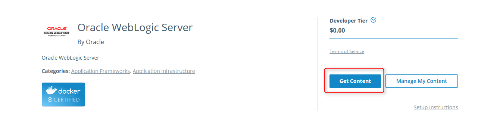
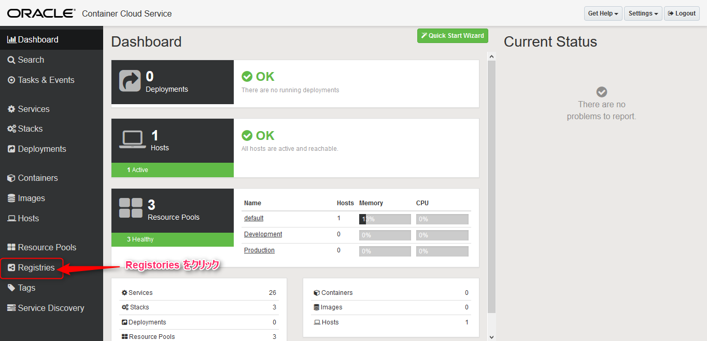

# オラクル公式のDockerイメージを使ってWebLogic環境をOracle Containe Cloud Serviceへ作成

Oracle and Docker certified official docker images are publish on **[Docker Store](https://store.docker.com/)** from Apr-19-2017. This tutorial describes how to urilize Container Cloud Service with Docker Store and create a WebLogic Server Container on it.

コンテナ化した Docker イメージを公開して配布するマーケット・プレイスである **[Docker Store](https://store.docker.com/)** でオラクル公式のDocker イメージの公開が始まりました。

- [Oracle Brings Oracle’s Flagship Databases and Developer Tools to the Docker Store](https://www.oracle.com/corporate/pressrelease/docker-oracle-041917.html)

このチュートリアルでは、Docker Store で公開している **[WebLogic Server](https://store.docker.com/images/oracle-weblogic-server-12c?tab=description)** のイメージを使用して Oracle Container Cloud Service に環境を作成します。

## 前提

- [Docker Store](https://store.docker.com/) のアカウントを持っている事
- [Oracle Container Cloud Servicre](https://cloud.oracle.com/container) を利用できる事

## 手順
### 1. Docker Store での Docker Image の管理
#### 1.1. Docker Image の取得

検索フォームに **oracle** と入力し検索します。するとオラクル及び Docker 公認のイメージが検索結果として表示されます。その中から **[WebLogic Server](https://store.docker.com/images/oracle-weblogic-server-12c?tab=description)** を選択します。WebLogic Server イメージ情報画面が表示されたら、画面右部の **Get Content** をクリックします。すると、ログインしているユーザーでのイメージ使用許可が得られます。

#### 1.2. WebLogic Docker イメージの確認

画面右上部のアカウント情報から、**My Content** を選択します。すると、ログインユーザーが現在使用許可のある Docker Store 上のイメージ一覧が表示されます。その中から、**Oracle WebLogic Server** を見つけ、**Setup** ボタンをクリックします。

`docker pull` のコマンド例が表示されています。そこで、この WebLogic Server Docker イメージの名前とタグが確認できます(as of Apr-19-2017)

- 名前: store/oracle/weblogic
- タグ: 12.2.1.2

### 2. Oracle Container Cloud Service に Docker Store を登録
#### 2.1. Container Cloud Service のサービス・コンソールにログイン

ログインするとダッシュボード画面が表示されます。画面左部のメニューから **Registries** をクリックし、Docker レジストリの編集を行います。

#### 2.2. レジストリへの Docker Store の追加

レジストリ一覧画面で、画面上部の **New Registory** をクリックします。

レジストリ情報を入力するモーダル画面が表示されます。ここに以下の情報を入力します:

- **URL**: **index.docker.io/store** (Docker Store の URL)
- **Email**: Docker Store に登録している Email アドレス
- **UserName**: Docker Store のアカウント名
- **Password**: Docker Store のアカウント・パスワード

**Validate** をクリックして、入力したDocker Sotre のアカウント情報の妥当性確認を行います。問題なければ、**Validated successfully** と表示されます。正常な事が確認できたら、画面左下部の **Save** をクリックして保存を行います。

保存を行うと、レジストリ一覧に **Docker Store** が追加されている事が確認できます。

#### 3. WebLogic サービスの定義
**Service** とは、Oracle Container Cloud Service でのコンテナの起動単位となります。実体は、Docker コンテナの起動 (`docker run` コマンドと起動パラメータ) 方法を予め定義したテンプレートになっています。これを利用する事で複雑になりがちなコンテナの起動方法をシンプルに実施する事が可能になります。

#### 3.1. サービス定義画面の表示

画面左部のメニューから **Services** をクリックします。すると、サービス一覧画面が表示されます。この画面の右上部の **New Service** をクリックします。

#### 3.2. 新規サービスの定義

サービス定義には最低以下の情報が必要となります:

- **Service Name**: サービス名
- **Image**: コンテナを作成するイメージ (名前:タグ)
- **オプション・パラメータ**: Docker を起動する時に追加するパラメータ
  - **Port**: WebLogic Server は管理コンソールにアクセスするためにポートを指定する必要があります。このコンテナ内でリッスンするポートと、ホスト環境のポートをマッピングする定義を追加するために使用（手順は後述）

画面右部から **Port** を見つけてチェックボックスにチェックをいれます。すると、画面左部に Port の入力箇所が表示されます。**Add** をクリックします。

するとモーダル画面が表示され、マッピングする対象のホスト環境側のポートとコンテナ側にポートの入力画面が表示されるので次のように入力します:

- **IP**: 入力不要
- **Host Port**: 7001
- **Container Port**: 7001
- **Protocol**: TCP

このように入力する事で、次のコマンドと同じ意味を持ちます:

- `docker run -p 7001:7001`

つまり、ホスト環境のアドレスに対して7001番ポートでアクセスする事で、コンテナ内の7001番ポートにフォワードする、という事になります。

モーダル画面から入力した内容が、登録された事が確認できます。

### 4. WebLogic サービスの起動（コンテナの起動）
#### 4.1. WebLogic コンテナのデプロイ

サービス一覧に **WebLogic サービス** が確認できます。このサービスの左部に表示されている緑色の **Deploy** をクリックします。

モーダル画面が表示され、いくかの入力フィールドが表示されますが、今回はデフォルト設定のままにします。**Deploy** をクリックします。

背後では `docker pull` が実行されて、Docker Store から WebLogic Server の Docker イメージがダウンロードされているため、しばらく待ちます。ダウンロードが終わるとコンテナが起動されます。

#### 4.2. コンテナ上の WebLogic Server へのログイン

デプロイメント画面が表示されます。この画面では、起動しているコンテナと、そのコンテナが配置されているホスト環境が確認できます。
まず、ここでコンテナ名をクリックして、コンテナに関する情報を確認してみます。

画面下部に複数のタブで分けられて種々のコンテナに関する情報が表示されています。今回は、現在起動した WebLogic Server のログを確認します。
画面中央に表示されている **View Log** をクリックします。

この View Log をクリックすることで Dokcer ログとして標準出力されているログを確認できます。
ところで、この **[WebLogic Server](https://store.docker.com/images/oracle-weblogic-server-12c?tab=description)** のイメージは、コンテナ作成時に管理者パスワードをランダムに自動生成するという説明が Docker Store のイメージ情報に記載されていました。
そこで、ログを見てパスワードを確認しておきます。ログを開くと、**admin password** という行があります。そこで管理者パスワードが確認できます。
このパスワードにより、WebLogic Server の管理コンソールのログインなどに使用します。

次に、デプロイメント画面からホスト名をクリックし、ホスト環境の情報を確認します。

このホスト情報画面では、ホスト環境に割り当てられている　**パブリック IP アドレス** を確認する事ができます。このアドレスを使用してコンテナにアクセスを行います。

管理者パスワードと、パブリックIPアドレスが確認できたので、コンテナ上の WebLogic 管理コンソールにアクセスしてみます。次の URL にアクセスします:

- **http://[PUBLIC IP]:7001/cosole**

  - ユーザー名: **weblogic**
  - パスワード: **ログで確認したパスワード**

管理コンソールで確認すると、管理サーバのみで構成されている最もシンプルなドメイン構成になっている事が分かります。

この WebLogic Server の Docker イメージをベースイメージとして、アプリケーションデプロイ済みの環境や、可用性構成の環境、または Coherence や Database 統合した環境などのカスタマイズイメージの作成が簡単に出来そうです。

## Demo

## Licence

Released under the [MIT license](https://gist.githubusercontent.com/shinyay/56e54ee4c0e22db8211e05e70a63247e/raw/44f0f4de510b4f2b918fad3c91e0845104092bff/LICENSE)

## Author

[shinyay](https://github.com/shinyay)
